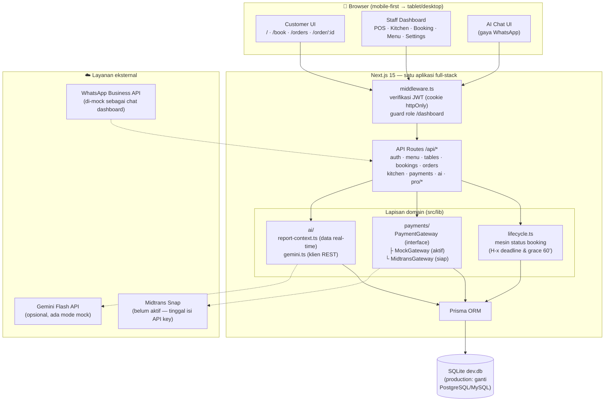
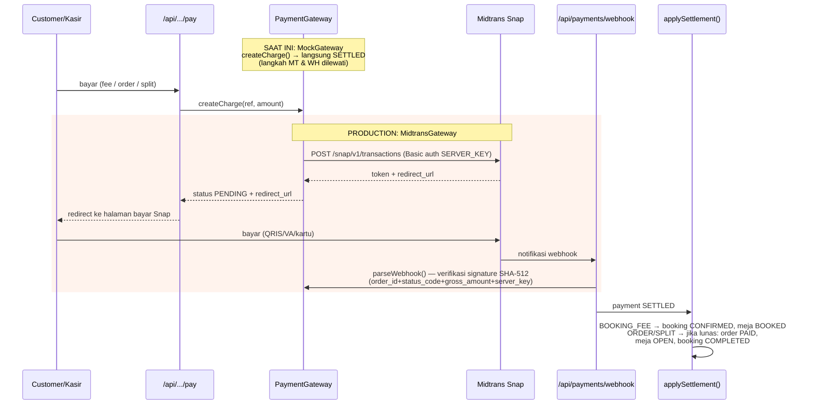
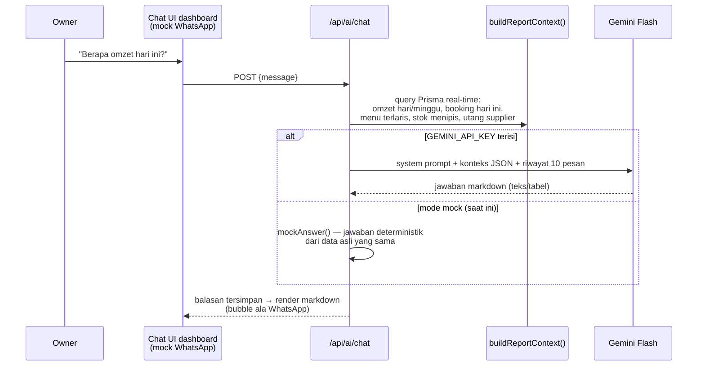
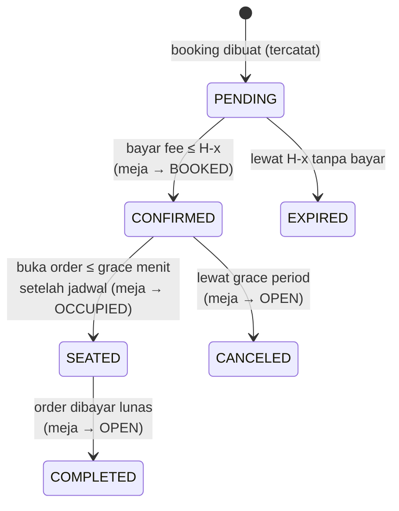

# Arsitektur CafeResto

Dokumen ini menjelaskan arsitektur aplikasi serta titik integrasi **Midtrans** (pembayaran)
dan **WhatsApp/Gemini** (AI agent) — kondisi saat ini vs production.

## 1. Arsitektur Keseluruhan

Poin desain:

- **Satu aplikasi Next.js** menampung frontend + REST API; tidak ada server terpisah.
- **Lapisan domain** (`src/lib`) memisahkan logika bisnis dari route handler sehingga
  endpoint tetap tipis dan mudah diuji.
- **Lifecycle booking** dijalankan opportunistik di endpoint terkait dan tersedia sebagai
  `GET/POST /api/lifecycle` untuk cron eksternal.
- **5 role** (OWNER, MANAGER, CASHIER, KITCHEN, CUSTOMER) di-enforce dua lapis:
  middleware (akses halaman) dan `requireRole()` di tiap route (akses API).

## 2. Integrasi Midtrans (abstraksi pembayaran)

Semua pemanggil — bayar fee booking, bayar order, split bill — hanya mengenal interface
`PaymentGateway` (`src/lib/payments/gateway.ts`). Pergantian provider murni lewat env
`PAYMENT_PROVIDER=mock|midtrans`, **tanpa perubahan kode**.

Aktivasi Midtrans:

1. Isi `.env`: `PAYMENT_PROVIDER=midtrans`, `MIDTRANS_SERVER_KEY=...`
   (`MIDTRANS_IS_PRODUCTION=true` untuk live).
2. Set **Notification URL** di dashboard Midtrans ke
   `https://domain-anda/api/payments/webhook`.

Efek domain pasca-pembayaran terpusat di `src/lib/payments/settle.ts`
(`applySettlement`, `closeOrderIfPaid`) sehingga jalur mock, cash, dan webhook
Midtrans melewati logika yang sama persis.

## 3. Integrasi AI Agent / WhatsApp

Jalur ke WhatsApp asli: logika `/api/ai/chat` sudah lengkap — tinggal menambah satu
endpoint webhook (mis. `/api/wa/webhook`) yang menerima pesan masuk dari WhatsApp
Business API / BSP (Twilio, Qiscus, dsb.), memanggil fungsi yang sama, lalu mengirim
balasan via API WA. UI dashboard tidak perlu diubah.

## 3b. Alur Scan & Serve (QR, pay-first)

Status order jalur QR: `DRAFT → AWAITING_PAYMENT → AWAITING_VALIDATION → IN_KITCHEN → PAID`
(detail di `docs/proposals/scan-and-serve-qr-self-ordering.md`).

- Mesin alur di `src/lib/qr-flow.ts`: `computeShares` (rincian per member),
  `moveToValidationOrKitchen` (hormati setting `requireCashierValidation`),
  `enterKitchen` (item DRAFT→QUEUED, meja OCCUPIED), `completeIfAllServed`.
- **Service fee** disnapshot ke Order saat dibuat (`serviceFeeType/Value`);
  pajak dihitung atas (subtotal + service fee) — terpusat di `orderTotal()`.
- Split **SINGLE**: 1 charge oleh host, settle → auto ke validasi.
  Split **UPFRONT**: charge per member via `pay-share`, lunas semua → host `finalize`.
- Jalur POS/booking tetap pay-later (`OPEN → PAID`), tidak berubah.

## 4. Lifecycle Booking (referensi)

Parameter H-x (hari), nominal fee, dan grace period (default 60 menit) diatur di
**Dashboard → Pengaturan**. Fee yang dibayar menjadi deposit tagihan order saat check-in.
