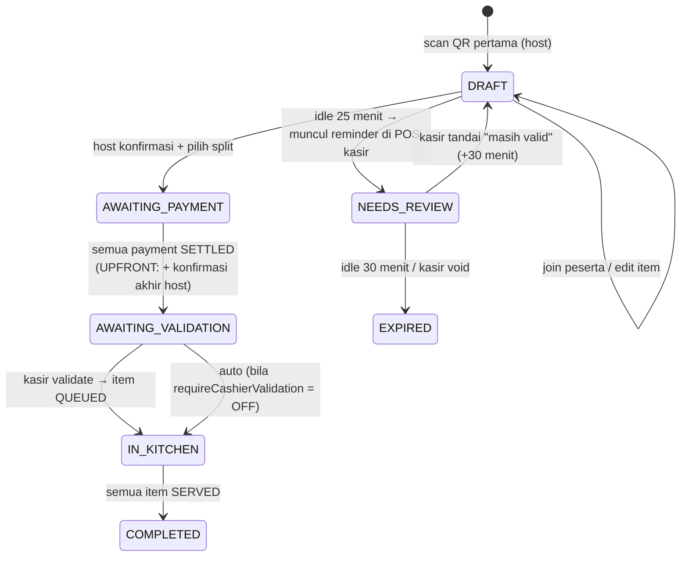

# Feature Proposal: Scan & Serve — QR Self-Ordering Kolaboratif

| | |
|---|---|
| **Status** | Proposed — menunggu approval |
| **Tanggal** | 2026-06-12 |
| **Scope** | Customer-facing ordering flow + dukungan backoffice |
| **Dokumen terkait** | `docs/ARCHITECTURE.md` |

## 1. Ringkasan

Mengubah jalur utama pemesanan customer dari "pilih meja manual + wajib login" menjadi
**scan QR di meja → isi nama (tanpa login) → keranjang kolaboratif multi-peserta →
bayar self-service (split di muka / split akhir) → validasi kasir → dapur**.

Jalur lama (pilih meja manual + bayar di akhir) **tidak dihapus** — tetap tersedia
sebagai fallback yang disamarkan (de-emphasized) di UI. Jalur POS kasir dan booking
tidak berubah perilakunya (tetap pay-later).

## 2. Keputusan Produk (terkunci)

| # | Keputusan | Nilai |
|---|---|---|
| K1 | Validasi kasir setelah pembayaran | **Configurable** (`requireCashierValidation`), default **ON** |
| K2 | Posisi alur QR | **Jalur utama**; fallback manual tetap ada tapi disamarkan |
| K3 | Split UPFRONT | **Per item milik masing-masing peserta** + dukungan **gabung bayar** (beberapa peserta diwakili satu pembayar/QR) |
| K4 | TTL draft | **30 menit idle**, dengan **reminder ke kasir sebelum expire** untuk cek validitas |
| K5 | Service fee | Fitur baru, configurable di backoffice: on/off + tipe (persen / nominal flat) |

## 3. User Story

### Story 1 — Split akhir (satu pembayar)

1. Customer A scan QR di Meja 4 → halaman join: isi **nama** + **no. HP (opsional)**
   dengan caption *"Struk digital Anda dikirim ke sini jika berminat"* → draft order
   terbuka, A menjadi **host**.
2. Teman B datang, scan QR yang sama → server mendeteksi draft aktif di meja itu →
   B diarahkan ke order yang sama, isi nama sendiri → jadi **member** (hanya bisa
   menambah/mengubah item miliknya).
3. A menekan **"Bagikan menu"** → link join terkirim via WhatsApp (`wa.me`) ke teman
   yang masih di jalan → mereka buka link, join, dan memilih menu dari perjalanan.
4. Semua selesai memilih → host **konfirmasi pesanan** → pilih **Split Akhir** →
   muncul **1 QR pembayaran** untuk total tagihan (subtotal + service fee + pajak −
   deposit bila ada) → host bayar.
5. Order masuk antrian **Validasi** di POS kasir → kasir validate → item masuk
   antrian dapur (QUEUED).

### Story 2 — Split di muka (bayar masing-masing)

Langkah 1–3 sama. Pada konfirmasi, host memilih **Split di Muka**:

4. Sistem membuat tagihan **per peserta** = item miliknya + service fee & pajak
   proporsional. Layar setiap peserta menampilkan QR bayarnya masing-masing
   (+ tombol share link bayar via WA).
5. **Gabung bayar:** sebelum charge dibuat, peserta bisa digabung ke satu
   *payment group* (mis. 2 dari 5 orang dibayari satu orang) → grup itu mendapat
   **satu QR** senilai gabungan tagihan anggotanya.
6. Ketika **semua** pembayaran SETTLED (termasuk host), host menekan
   **konfirmasi akhir** → order masuk antrian Validasi kasir → dapur.

## 4. State Machine Order (jalur QR)



Aturan TTL (K4): pada menit ke-25 idle, draft masuk daftar **"Perlu Perhatian"** di POS
(dengan badge); kasir bisa konfirmasi valid (perpanjang) atau void. Tanpa aksi, draft
auto-expire di menit ke-30 dan meja dibebaskan. Dijalankan oleh mesin lifecycle yang
sudah ada (`src/lib/lifecycle.ts`).

## 5. Perhitungan Tagihan (dengan service fee baru)

```
subtotal      = Σ (harga item × qty)            — per order, atau per peserta saat UPFRONT
service fee   = subtotal × persen | nominal flat (jika diaktifkan)
pajak         = (subtotal + service fee) × taxPercent   ← standar resto Indonesia
total         = subtotal + service fee + pajak − deposit booking (bila ada)
```

Pengaturan baru di **Dashboard → Pengaturan**: `serviceFeeEnabled` (on/off),
`serviceFeeType` (`PERCENT`|`FLAT`), `serviceFeeValue`.

## 6. Perubahan Teknis

### 6.1 Schema (Prisma)

| Model | Perubahan |
|---|---|
| `Table` | + `code` (slug pendek acak untuk URL QR, unique) |
| `Order` | + status `DRAFT`, `AWAITING_PAYMENT`, `AWAITING_VALIDATION`, `IN_KITCHEN`; + `splitMode` (`SINGLE`\|`UPFRONT`), `source` (`QR`\|`POS`\|`BOOKING`), `lastActivityAt`, `needsReviewAt` |
| `OrderParticipant` *(baru)* | `orderId`, `name`, `phone?`, `isHost`, `paymentGroupId?`, `joinedAt` |
| `PaymentGroup` *(baru)* | `orderId`, `payerParticipantId` — wadah gabung bayar (K3) |
| `OrderItem` | + `participantId?`, + status `DRAFT` (sebelum `QUEUED`) |
| `Payment` | + `paymentGroupId?` |
| `MenuItem` | + `prepMinutes?` (estimasi pembuatan, configurable per menu) |
| `MenuPhoto` *(baru)* | `menuItemId`, `url`, `isPrimary`, `sort` — katalog multi-foto |
| `Setting` | + `requireCashierValidation`, `draftTtlMinutes` (30), `serviceFee*` |

### 6.2 API

| Endpoint | Fungsi |
|---|---|
| `GET /t/[code]` *(page)* | Resolusi QR meja → join/buat draft → form nama + HP opsional |
| `POST /api/orders/[id]/join` | Daftarkan peserta (guest session cookie) |
| `POST /api/orders/[id]/confirm` | Host: kunci draft, pilih `splitMode`, bentuk payment group, buat charge |
| `POST /api/orders/[id]/validate` | Kasir: validate → item `QUEUED` (atau void) |
| `POST /api/orders/[id]/review` | Kasir: tandai draft "masih valid" (perpanjang TTL) |
| `POST /api/menu/[id]/photos` | Kelola foto katalog menu |
| Guest auth | JWT guest (cookie) berisi `participantId` + nama; login customer tetap ada untuk booking & riwayat |

### 6.3 UI

1. **Halaman join QR** (`/t/[code]`) — form nama + HP opsional dengan caption struk digital.
2. **Halaman order kolaboratif** — daftar item per peserta, badge host, tombol
   "Bagikan menu" (WA), konfirmasi + pemilihan split, layar QR bayar per
   peserta/grup, status menunggu pembayaran teman.
3. **POS** — panel baru **Validasi** + daftar **Perlu Perhatian** (TTL reminder).
4. **Dashboard Meja** — tombol **Cetak QR** (grid QR siap print, library `qrcode` client-side).
5. **Fallback flow lama** — tetap ada, ditempatkan sekunder (mis. link kecil
   "pesan tanpa scan QR").

## 7. Improvement UI Tambahan (di luar alur QR, satu paket rilis)

### 7.1 Kartu menu dengan foto

- Foto di **1/3 kiri kartu, flush** (tanpa margin/padding), deskripsi + **estimasi
  lama pembuatan** (dari `prepMinutes`) tampil di kanan.
- Multi-foto katalog per menu (`MenuPhoto`): satu **foto utama**, sisanya thumbnail.
- Tujuan jangka panjang: data foto siap dipakai **tema dinamis layout buku menu** —
  konfigurasi tema itu sendiri masuk **modul PRO Menu** (placeholder dulu, di luar
  scope implementasi ini).

### 7.2 Metric cards dashboard

- Ikon **tanpa background**, ukuran **+2 step** (22 → 32), **divider** antara ikon
  dan teks.
- **State selected yang jelas** tanpa mengubah background/ukuran: ring/border aksen
  warna sunset + ikon berubah weight `fill`.

### 7.3 Regulasi klik meja di POS

Masalah: klik meja langsung auto-buka order; klik meja lain auto-buka lagi →
membingungkan dan rawan order tak sengaja.

Solusi: klik meja → **panel pratinjau** (status meja, order berjalan bila ada).
Order baru hanya dibuat lewat tombol eksplisit **"Buka Order"**; meja dengan order
berjalan menampilkan **"Lanjutkan Order"**. Satu klik ekstra, nol order tak sengaja.

## 8. Rencana Branching & PR

```
main  (selalu deployable; semua PR direview & merge oleh owner)
 │
 ├─ feature/01-qr-core            → PR: Scan & Serve fondasi
 │     guest session · Table.code · /t/[code] · draft kolaboratif ·
 │     OrderParticipant · atribusi item · share WA
 │
 ├─ feature/02-payment-split      → PR: Pembayaran & validasi   (setelah 01 merge)
 │     service fee · confirm + SINGLE/UPFRONT · payment group (gabung bayar) ·
 │     antrian validasi kasir · handoff dapur
 │
 ├─ feature/03-ops-polish         → PR: Operasional             (setelah 02 merge)
 │     TTL 30' + reminder kasir · cetak QR · ronde-2 · edge case tak bayar
 │
 └─ feature/04-ui-refresh         → PR: UI refresh              (independen, bisa paralel)
       kartu menu berfoto + prepMinutes + MenuPhoto · metric cards · POS table flow
```

- PR digabung **berurutan 01 → 02 → 03**; **04 independen** (bisa dikerjakan/di-merge
  kapan saja karena tidak menyentuh state machine).
- Tiap PR menyertakan update `docs/ARCHITECTURE.md` bila menyentuh arsitektur,
  hasil smoke test end-to-end, dan catatan migrasi (`prisma db push` + seed).

## 9. Di Luar Scope (eksplisit)

- Push notification nyata (WhatsApp Business API / web push) — "notif" v1 = layar
  peserta berubah via polling + share link WA manual.
- Realtime SSE/WebSocket — v1 tetap polling 3–4 detik (pola yang ada).
- Konfigurasi tema buku menu (PRO) — hanya fondasi data foto yang disiapkan.
- Upload foto ke cloud storage — v1 menyimpan lokal (`public/uploads`) di balik
  abstraksi storage sederhana agar mudah dipindah ke S3/R2.

## 10. Risiko & Mitigasi

| Risiko | Mitigasi |
|---|---|
| QR statis bisa discan orang yang tidak di lokasi (iseng) | Pay-first + validasi kasir (K1) + TTL 30' dengan review kasir (K4) |
| Peserta UPFRONT tidak kunjung bayar | Host bisa pindahkan peserta ke grup bayarnya / hapus peserta; order tidak pernah masuk dapur sebelum lunas |
| Cookie guest hilang (ganti browser/incognito) | Layar "pilih nama Anda" untuk re-claim peserta di order aktif |
| Draft menumpuk menahan meja | TTL + daftar "Perlu Perhatian" kasir |
| Service fee mengubah perhitungan lama | Terapkan terpusat di `getOrderDue()` — satu titik perubahan, dicover smoke test ulang |

## 11. Acceptance Criteria (ringkas)

1. Dua device berbeda dapat join satu draft dari QR yang sama tanpa login; item
   teratribusi ke nama masing-masing; dapur belum melihat apa pun.
2. SINGLE: satu QR; UPFRONT: QR per peserta/grup dengan nilai = item milik +
   fee/pajak proporsional; gabung bayar menghasilkan satu QR gabungan.
3. Order lunas hanya tampil di dapur setelah kasir validate (atau otomatis bila
   setting OFF).
4. Draft idle 25' muncul di "Perlu Perhatian"; 30' auto-expire bila tanpa aksi.
5. Service fee on/off + persen/flat berlaku konsisten di semua tagihan & laporan.
6. Kartu menu menampilkan foto 1/3 kiri flush, deskripsi, estimasi menit; metric
   card dan alur klik meja POS sesuai §7.
